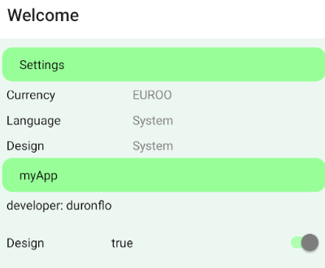

# react-native-modular-kit

## Feature list

- Jest-Test integration 
  - jest configuration according to react-native-testing-library [Link](https://callstack.github.io/react-native-testing-library/)
  - react-redux testing (including redux-toolkit)
- Integrated three-dotted-button in welcome screen
- Modal screen (work on that needs to be done; similar to SettingList configuration)
- Simple list of flexible content (using redux) 
  - Link with Link and current value (e.g.: Currency -> EUROO)
  - Info text 
  - Switch (e.g. Design --> true)



## important commands

initial setup

```sh
npm install
```

run tests

```sh
npm test
```

start expo environment

```sh
npx expo start
```